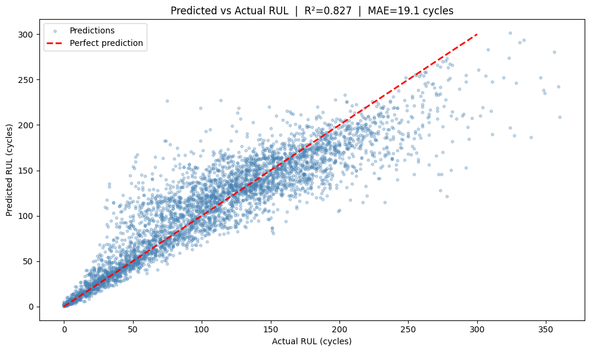
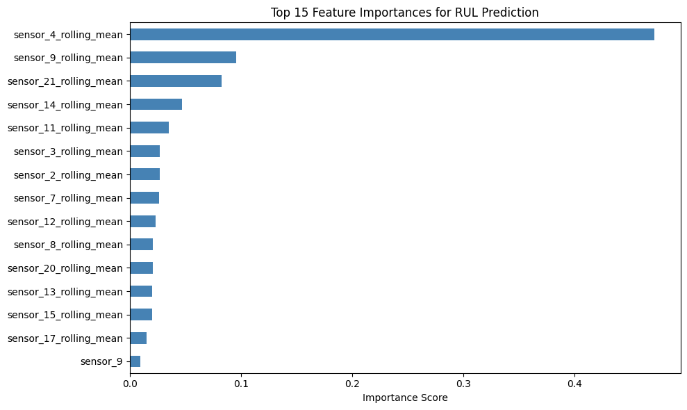

# ✈️ Aircraft Engine Failure Prediction

Predicting the Remaining Useful Life (RUL) of aircraft turbofan engines 
using machine learning and sensor data from NASA's CMAPSS dataset.

## 📊 Results

| Model | R² Score | MAE (cycles) |
|---|---|---|
| Random Forest (baseline) | 0.626 | 29.5 |
| Random Forest + Feature Engineering | **0.827** | **19.1** |



## 🔍 Project Overview

Predictive maintenance is critical in aerospace — an unexpected engine 
failure mid-flight is catastrophic, while replacing engines too early 
is costly. This project builds a machine learning model that predicts 
**how many cycles remain before an engine fails**, using 14 physical 
sensor readings from 100 turbofan engines.

## 📁 Project Structure

```
physics-anomaly-detector/
├── data/                   ← NASA CMAPSS dataset
├── notebooks/
│   └── 01_explore_data.ipynb   ← Full analysis pipeline
├── results/
│   ├── engine1_all_sensors.png
│   ├── feature_importance.png
│   └── predictions_vs_actual.png
└── README.md
```

## 🧠 Methodology

### 1. Exploratory Data Analysis

- Loaded and visualized all 21 sensor readings for 100 engines
- Identified and removed 7 flat/non-informative sensors using 
  both statistical analysis (std ≈ 0) and visual inspection

### 2. Feature Engineering

- Calculated **Remaining Useful Life (RUL)** as the target variable
- Added **10-cycle rolling averages** per sensor to smooth noise 
  and capture degradation trends — analogous to a low-pass filter 
  in signal processing

### 3. Model Training

- Trained a **Random Forest Regressor** (100 trees) on 80% of the data
- Evaluated on held-out 20% test set

### 4. Key Finding

Sensor 11 (fan exit temperature) was the strongest predictor of 
engine failure with ~40% feature importance — consistent with 
thermodynamic theory, as a degrading turbofan loses efficiency 
and runs progressively hotter.



## 🛠️ Tech Stack

- Python 3.11.9
- Pandas, NumPy
- Scikit-learn
- Matplotlib

## 📂 Dataset

[NASA CMAPSS Turbofan Engine Degradation Dataset](https://www.kaggle.com/datasets/behrad3d/nasa-cmaps)